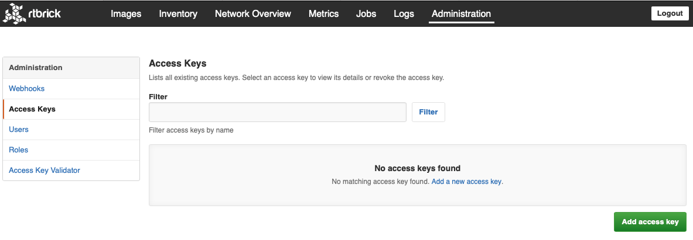
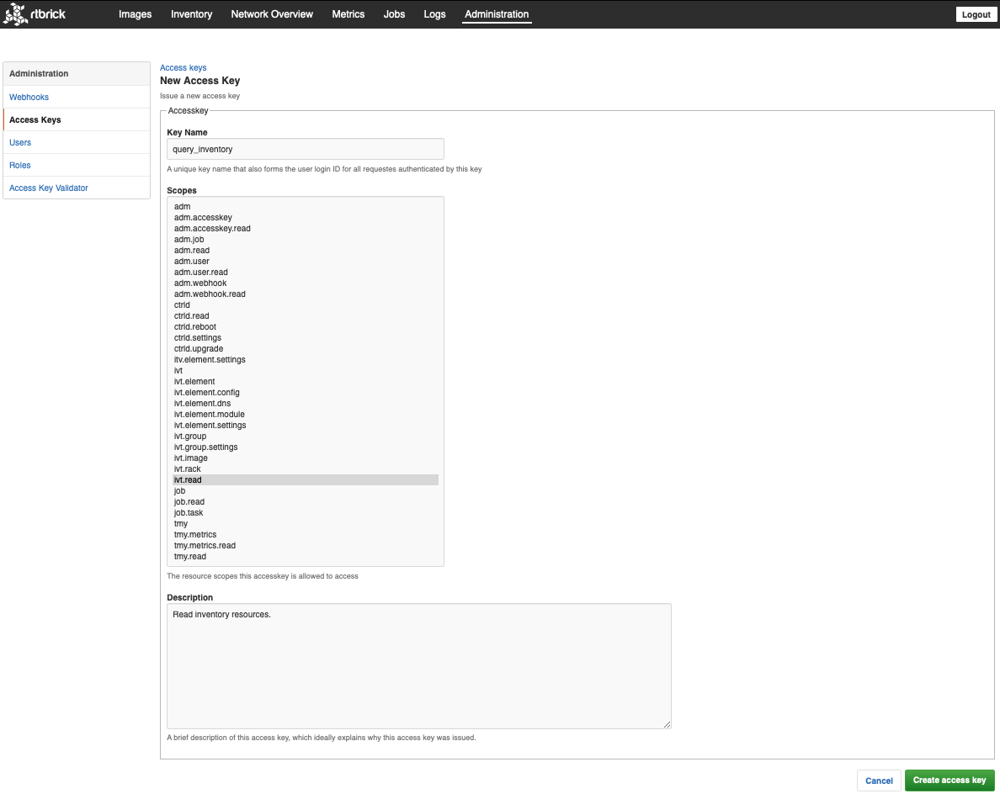
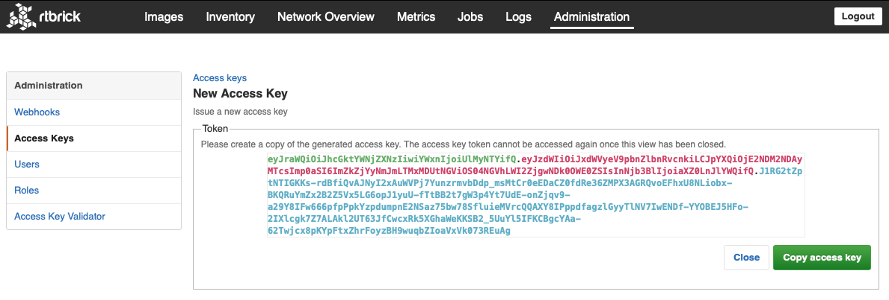
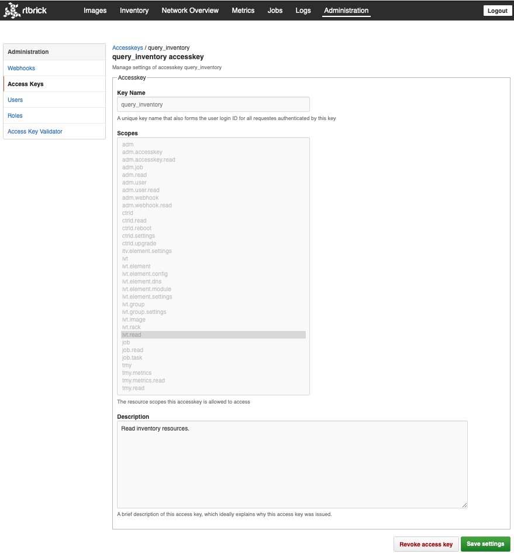
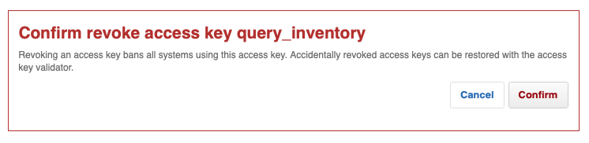
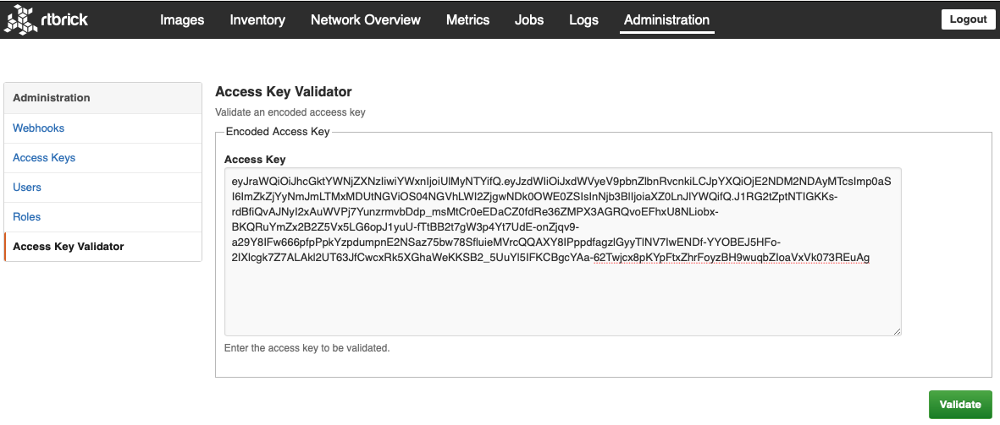
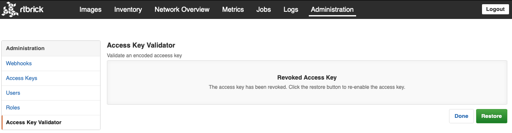
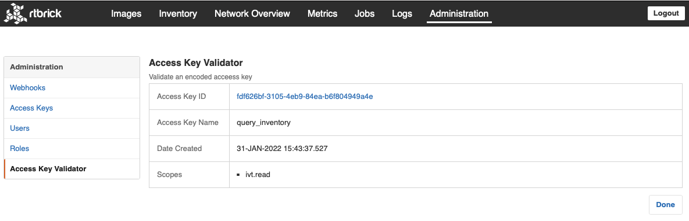

# Leitstand Security User Interface

The _Leitstand Security User Interface_ adds user, role and access key management views to the _Leitstand Administration Console_.

# Access Keys

Let's walk through the most important access key views.

The **Access Keys** view lists all access keys.

 

Click the **Add access key** button to create a new access key.

 

Assign a unique name, 
select the [resource scopes](../leitstand-auth/README.md) the access key is allowed to access and
add an optional description.

Click the **Create access key** button to create the access key.

 

Click the **Copy access key** button to copy the generated access key into the clipboard.

**NOTE:** The access key cannot be viewed again after closing this view.

The access key list shows the newly created access key.

Click the access key to inspect the access key details. 
It shows the access key name, accessible resource scopes and the access key description.

 

The access key is immutable. Only the description can be amended. 

Click the **Revoke access key** button to invalidate the access key.

 

Click the **Confirm** button to revoke the access key.

In case an access key was revoked accidentally it can be restored with the access key validator.

Click **Access Key Validator** to open the access key validator and paste the access key into the textarea.

Click the **Validate access key** button to validate the access key. 
The access key validator allows restoring a valid access key.

 

Click the **Restore access key** button to restore the access key.

The access key validator also displays the status of valid access keys.

 

# Users and Roles